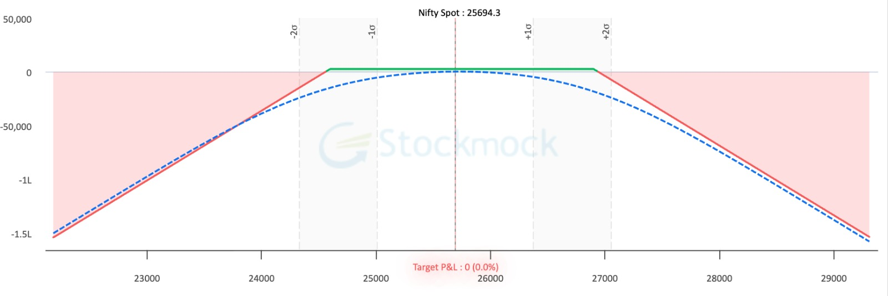
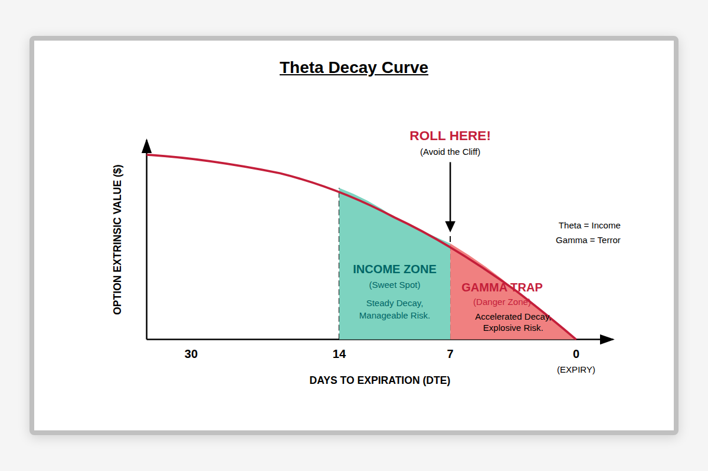
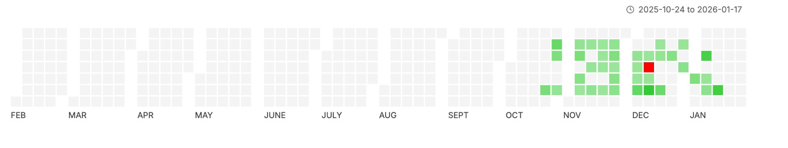

# NIFTY 7-Delta Strangle Trading System

A semi-automated options trading system for NIFTY index using 7-delta strangle strategy with Zerodha Kite Connect integration.



## Overview

This system helps traders execute and manage short strangle positions on NIFTY options. It identifies delta-based strikes (configurable 5-10 delta), monitors entry signals based on straddle premium vs VWAP, and provides tools for position management with profit targets.

### Trading Strategy

The system implements a **Delta-based Short Strangle** strategy:

1. **Strike Selection**: Sells both Call and Put options with configurable delta (default 7-delta)
2. **Entry Signal**: Enters when ATM straddle price > straddle VWAP for 5 minutes
3. **Entry Windows**: Morning (9:30-13:15) and Afternoon (13:15-15:15) - max 1 trade per window
4. **Exit Target**: 50% of maximum profit (premium collected) - per expiry
5. **Move Strategy**: Adjusts losing leg when decay drops below threshold (e.g., 60%)
6. **Position Sizing**: Split capital into multiple chunks (recommended 6, minimum 3)
7. **Layering**: Enter one chunk per entry signal, layering multiple high-probability strangles during gamma moves
8. **DTE Management**: Positions are not recommended to hold beyond 7 DTE (days to expiry)

### Why 7-Delta?

- 7-delta options have approximately 93% probability of expiring worthless
- Provides good balance between premium collection and risk
- Strikes are typically far enough from spot to withstand normal market movements



## Features

### Market Monitor
- Real-time NIFTY spot price and synthetic futures
- ATM straddle price and VWAP comparison
- Entry signal detection with 5-minute confirmation timer
- Delta-based strangle strikes with live premiums and Greeks
- Margin requirement calculation (with span benefit)
- PCR (Put-Call Ratio) and Max Pain display

### Position Management
- Current open positions with P&L tracking
- Decay percentage for each leg (for move decisions)
- Trade history grouped by expiry
- Manual profit entry for adjustments
- Max profit and 50% target calculation per expiry

### Auto Trade Mode
- **Auto-Entry**: Automatically executes trades when entry signal is ready
- **Auto-Exit**: Automatically exits positions when 50% profit target is reached
- **Per-Expiry**: Exit targets calculated and executed separately for each expiry
- **Flexible**: Can be enabled/disabled mid-session
- **Works with Manual Trades**: Auto-exit monitors all positions, not just auto-entered ones

### Move Position (Decay Strategy)
- Visual indicator when a leg's decay falls below threshold
- One-click move to roll the losing leg to a new strike
- Adjustable target strike with +/- controls
- Maintains delta-based strike selection

### Exit Management
- Visual alert when 50% profit target reached (green highlight)
- One-click "Exit All Positions" button per expiry
- Market orders for quick execution



### Account Info
- Available margin display (auto-refreshes every minute)
- Used margin display (matches Zerodha Console)
- Connection status with Zerodha

## Prerequisites

- Python 3.9 or higher
- Zerodha trading account with Kite Connect API access
- API Key and Secret from [Kite Connect Developer Console](https://developers.kite.trade/)

## Installation

### 1. Clone the Repository

```bash
git clone https://github.com/IndujaCons/nifty_strangle_trader.git
cd nifty_strangle_trader
```

### 2. Create Virtual Environment

**macOS/Linux:**
```bash
python3 -m venv venv
source venv/bin/activate
```

**Windows:**
```bash
python -m venv venv
venv\Scripts\activate
```

### 3. Install Dependencies

```bash
pip install -r requirements.txt
pip install flask  # For web UI
```

### 4. Configure Environment

Create a `.env` file in the project root:

```env
# Zerodha Kite Connect Credentials
KITE_API_KEY=your_api_key_here
KITE_API_SECRET=your_api_secret_here
KITE_ACCESS_TOKEN=

# Trading Configuration
PAPER_TRADING=true
LOT_QUANTITY=1
TARGET_DELTA=0.07
MOVE_DECAY_THRESHOLD=0.60
AUTO_TRADE=false
```

## Usage

### Starting the Application

**macOS/Linux:**
```bash
python run.py --ui
```

**Windows:**
Double-click `run_ui.bat` or run:
```bash
python run.py --ui
```

The web UI will be available at: **http://localhost:8080**

### First-Time Login

1. Open http://localhost:8080 in your browser
2. Click "Get Login URL" in the Login & Settings panel
3. Complete Zerodha login and authorize the app
4. Copy the `request_token` from the redirect URL
5. Paste it in the app and click "Complete Login"
6. Your access token is saved for the session

### Settings

| Setting | Range | Description |
|---------|-------|-------------|
| **Live Trading** | On/Off | Toggle between paper and live trading |
| **Auto Trade** | On/Off | Enable automatic entry and exit |
| **Lots per Trade** | 1-50 | Number of lots to trade |
| **Target Delta** | 5-10 | Delta value for strike selection |
| **Move Decay %** | 0-100 | Decay threshold to trigger move alert |

### Manual Trading

1. **Check Market Monitor**: Wait for "ENTRY READY" signal (straddle > VWAP for 5 mins)
2. **Review Strangle**: Check the delta-based strikes, premiums, and margin required
3. **Adjust if needed**: Use +/- buttons to modify strikes
4. **Click "Place Trade"**: Executes market orders for both legs

### Auto Trading

1. **Enable Auto Trade** toggle in Settings
2. **Set Target Delta** as per market conditions (lower delta = safer, higher delta = more premium)
3. **System will automatically**:
   - Enter trades when entry signal is ready (max 1 per window)
   - Exit positions when 50% profit target is reached (per expiry)
4. **Move decisions** still require manual intervention

### Monitoring Positions

- **Positions Tab**: View current open positions with live P&L and decay %
- **History Tab**: Track profit by expiry with max profit and 50% target

### Exiting Positions

**Manual Exit:**
- When profit reaches 50% target, the expiry card turns green
- Click "Exit All Positions" to close all positions for that expiry

**Auto Exit:**
- With Auto Trade enabled, positions exit automatically at 50% profit
- Works per-expiry (multiple expiries tracked independently)

## Configuration Options

| Parameter | Default | Description |
|-----------|---------|-------------|
| `PAPER_TRADING` | true | Enable paper trading mode (no real orders) |
| `AUTO_TRADE` | false | Enable automatic entry and exit |
| `LOT_QUANTITY` | 1 | Number of lots per trade |
| `TARGET_DELTA` | 0.07 | Target delta for strike selection (0.05-0.10) |
| `MOVE_DECAY_THRESHOLD` | 0.60 | Decay % threshold for move alerts |
| `signal_duration_seconds` | 300 | Signal confirmation time (5 mins) |

## Project Structure

```
nifty_strangle_trader/
├── ui/                     # Web UI (Flask)
│   ├── app.py             # API endpoints
│   └── templates/         # HTML templates
├── data/                   # Data providers
│   ├── kite_data_provider.py
│   ├── trade_history.py   # Trade history persistence
│   └── pcr_history.py     # PCR tracking
├── config/                 # Configuration
│   └── settings.py
├── core/                   # Core trading logic
│   ├── strategy_engine.py
│   ├── signal_tracker.py  # Entry signal tracking
│   └── position_manager.py
├── greeks/                 # Options Greeks calculation
│   └── black_scholes.py
├── data_store/            # Local data persistence
│   ├── trade_history.csv
│   └── daily_trades.json
├── docs/                  # Documentation
│   └── images/           # Screenshots and diagrams
├── run.py                 # Application entry point
└── requirements.txt
```

## Important Notes

### Risk Warning

**Options trading involves substantial risk of loss and is not suitable for all investors.**

- This system sells naked options which have unlimited risk potential
- Past performance does not guarantee future results
- Always use paper trading mode first to understand the system
- Never trade with money you cannot afford to lose

### Paper Trading

The system starts in `PAPER_TRADING=true` mode by default. In this mode:
- No real orders are placed
- All trades are simulated
- Use this to test and understand the system

To enable live trading, set `PAPER_TRADING=false` or toggle "Live Trading" in the UI.

### Access Token Expiry

Zerodha access tokens expire daily at midnight. You need to re-login each trading day.

### Market Hours

The system is designed for NSE market hours:
- Pre-Market: 9:00 AM - 9:15 AM IST
- Market Open: 9:15 AM IST
- Market Close: 3:30 PM IST
- Morning Window: 9:30 AM - 1:15 PM
- Afternoon Window: 1:15 PM - 3:15 PM

### NSE Expiry

- Weekly expiry: Every Tuesday (changed from Thursday)
- Monthly expiry: Last Tuesday of the month

## Troubleshooting

### Port Already in Use

The application automatically kills any existing process on port 8080 when starting.

### Connection Issues

1. Verify your API key and secret in `.env`
2. Re-login if access token has expired
3. Check Zerodha API status

### Margin Calculation Shows 0

Ensure you're logged in and have a valid access token. The margin API requires authentication.

### Auto Trade Not Working

1. Ensure "Live Trading" is ON (Auto Trade only places real orders in live mode)
2. Check if entry signal is ready (5-minute VWAP condition)
3. Verify you haven't already traded in the current window

## License

This project is for educational purposes only. Use at your own risk.

## Contributing

Contributions are welcome! Please feel free to submit a Pull Request.

## Support

For issues and feature requests, please open an issue on GitHub.

---

**Disclaimer**: This software is provided "as is" without warranty of any kind. The authors are not responsible for any financial losses incurred through the use of this system. Always do your own research and consult with a qualified financial advisor before trading.
